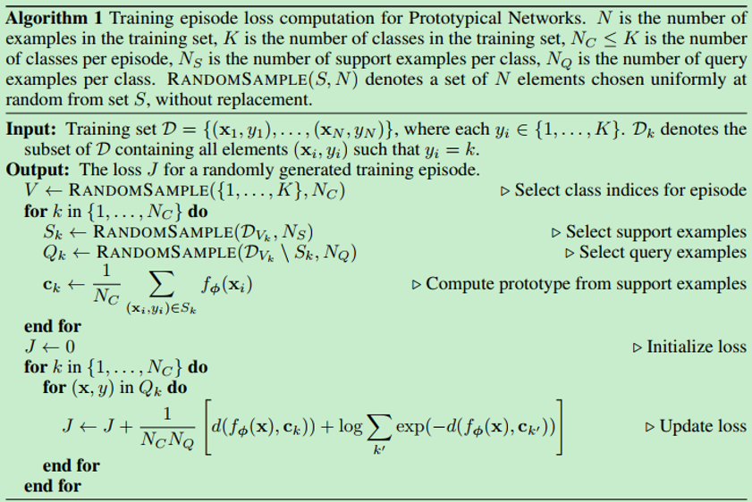
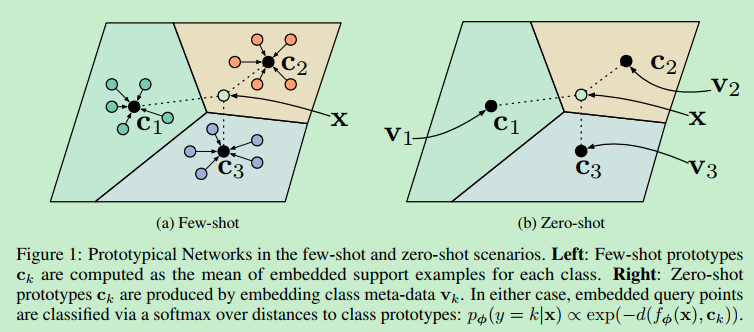
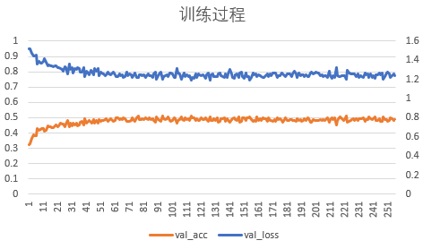

# 论文复现：Prototypical Networks for Few-shot Learning

## 一、简介

Prototypical networks for few-shot learning是小样本学习方向的一篇经典论文，是一种基于元学习的小样本分类方法。
ProtoNet虽然也是通过构建很多组不同的episode（即元任务）进行训练，但与其他元学习方法的不同之处在于，
ProtoNet目的在于获得一个encoder，将输入图片映射到一个高维的特征空间。在该特征空间中，
support set中每类样本的均值向量，即为该类别的prototype向量，
需要对query样本与各类别的prototype向量求欧式距离，并以此距离作为后续对类别归属及loss函数的构建依据。
完整的算法流程如下图所示：



ProtoNet算法的优势在于，其Prototype向量可以通过support样本求均值获得，从而解决小样本分类问题；
还可以通过直接设定类别的高层语义描述，用于零样本分类问题的解决。



论文链接：[Prototypical Networks for Few-shot Learning](https://proceedings.neurips.cc/paper/2017/file/cb8da6767461f2812ae4290eac7cbc42-Paper.pdf)

## 二、复现精度

基于paddlepaddle深度学习框架，对文献算法进行复现后，本项目达到的测试精度，如下表所示。

|task|本项目精度|参考文献精度|
|----|----|----|
|5-way-1-shot|50.14+-0.78|49.42+-0.78|
|5-way-5-shot|68.28+-0.64|68.20+-0.66|


5-way-1-shot超参数配置如下：

|超参数名|设置值|
|----|----|
|data.way|30|
|data.shot|1|
|data.query|15|
|data.test_way|5|
|data.test_shot|1|
|data.test_query|15|
|lr|0.001|

5-way-5-shot超参数配置如下：

|超参数名|设置值|
|----|----|
|data.way|20|
|data.shot|5|
|data.query|15|
|data.test_way|5|
|data.test_shot|5|
|data.test_query|15|
|lr|0.001|

## 三、数据集
miniImageNet数据集节选自ImageNet数据集。
DeepMind团队首次将miniImageNet数据集用于小样本学习研究，从此miniImageNet成为了元学习和小样本领域的基准数据集。
  
- 数据集大小：
  - miniImageNet包含100类共60000张彩色图片，其中每类有600个样本，每张图片的规格为84 × 84。
    mini-imagenet一共有2.86GB
- 数据格式：
```
|- miniImagenet
|  |- images/
|  |  |- n0153282900000005.jpg 
|  |  |- n0153282900000006.jpg
|  |  |- …
|  |- train.csv
|  |- test.csv
|  |- val.csv
```

数据集链接：[miniImagenet](https://aistudio.baidu.com/aistudio/datasetdetail/105646/0)

## 四、环境依赖

- 硬件：
    - x86 cpu
    - NVIDIA GPU
- 框架：
    - PaddlePaddle = 2.1.2

- 其他依赖项：
    - numpy==1.19.3
    - tqdm==4.59.0
    - Pillow==8.3.1

## 五、快速开始

### 1、下载数据集：
这里给出miniImageNet的下载链接：[miniImagenet](https://aistudio.baidu.com/aistudio/datasetdetail/105646)

下载完成后，解压到某一路径下，如/home/aistudio/data/mini-imagenet-sxc。可参考本项目在aistudio上的公开项目，[点击此处](https://aistudio.baidu.com/aistudio/projectdetail/2311489?shared=1)

### 2、执行以下命令启动训练：

```
python run_train.py --data.way 30 --data.shot 1 --data.query 15 --data.test_way 5 --data.test_shot 1 --data.test_query 15 --data_root /home/aistudio/data/mini-imagenet-sxc
``` 

模型开始训练，运行完毕后，有三个文件保存在./results目录下，分别是:

```
best_model.pdparams  # 最优模型参数文件
opt.json  # 训练配置信息
trace.txt  # 训练LOG信息
```

训练完成后，可将上面三个文件手动保存到其他目录下，避免被后续训练操作覆盖。

### 3、执行以下命令进行评估

```
python run_eval.py --model.model_path results/5w1s/best_model.pdparams --data.test_way 5 --data.test_shot 1 --data.test_query 15 --data_root /home/aistudio/data/mini-imagenet-sxc
```

用于评估模型在小样本任务下的精度。

## 六、代码结构与详细说明
### 6.1 代码结构
```
├── images                          # README.md图片
├── protonets                       # 模型代码
│   ├── data                        # 数据相关
│   ├── models                      # 模型相关
│   ├── utils                       # 公共调用
├── README.md                       # readme
├── requirements.txt                # 依赖
├── run_eval.py                     # 执行评估
├── run_train.py                    # 启动训练入口
├── results                         # 结果
│   ├── 5w1s                        # 5w1s最优结果
│   ├── 5w5s                        # 5w5s最优结果
├── scripts                         # 训练和推理脚本
│   ├── predict                     # 推理脚本目录
│   ├── train                       # 训练脚本目录
│   ├── averagevaluemeter.py        # 均值计算
```

### 6.2 参数说明
可以在 `run_train.py` 中设置训练与评估相关参数，具体如下：

|  参数   | 默认值  | 说明 | 其他 |
|  ----  |  ----  |  ----  |  ----  |
| --data.way | 30 | 训练ways | 5-way-1-shot训练时设置为30，5-way-5-shot训练时设置为20 |
| --data.shot | 1 | 训练shots ||
| --data.query | 15 | 训练queries ||
| --data.test_way | 5 | 测试ways ||
| --data.test_shot | 1 | 测试shots ||
| --data.test_query | 15 | 测试queries ||
| --data_root | 必选 | 设置miniImageNet数据集路径 |在本项目所公开的aistudio项目下，路径可配置为/home/aistudio/data/mini-imagenet-sxc|

可以在 `run_eval.py` 中设置训练与评估相关参数，具体如下：

|  参数   | 默认值  | 说明 | 其他 |
|  ----  |  ----  |  ----  |  ----  |
| --model.model_path | results/best_model.pdparams | 要评估的模型参数路径 | 5-way-1-shot的路径为./results/5w1s，5-way-5-shot的路径为./results/5w5s |
| --data.test_way | 5 | 测试ways ||
| --data.test_shot | 1 | 测试shots ||
| --data.test_query | 15 | 测试queries ||
| --data_root | 必选 | 设置miniImageNet数据集路径 |在本项目所公开的aistudio项目下，路径可配置为/home/aistudio/data/mini-imagenet-sxc|


### 6.3 训练流程
可参考快速开始章节中的描述
#### 训练输出
执行训练开始后，将得到类似如下的输出。每一轮`epoch`训练将会打印当前training loss、training acc、val loss、val acc以及训练kl散度。
```text
/home/aistudio/prototypical-networks-paddle
W0830 09:31:39.461673  1253 device_context.cc:404] Please NOTE: device: 0, GPU Compute Capability: 7.0, Driver API Version: 11.0, Runtime API Version: 10.1
W0830 09:31:39.465984  1253 device_context.cc:422] device: 0, cuDNN Version: 7.6.
Epoch 1 train:   0%|                                    | 0/100 [00:00<?, ?it/s]/opt/conda/envs/python35-paddle120-env/lib/python3.7/site-packages/paddle/tensor/creation.py:125: DeprecationWarning: `np.object` is a deprecated alias for the builtin `object`. To silence this warning, use `object` by itself. Doing this will not modify any behavior and is safe. 
Deprecated in NumPy 1.20; for more details and guidance: https://numpy.org/devdocs/release/1.20.0-notes.html#deprecations
  if data.dtype == np.object:
/opt/conda/envs/python35-paddle120-env/lib/python3.7/site-packages/paddle/nn/layer/norm.py:641: UserWarning: When training, we now always track global mean and variance.
  "When training, we now always track global mean and variance.")
Epoch 1 train: 100%|██████████████████████████| 100/100 [03:32<00:00,  2.12s/it]
Epoch 1 valid: 100%|██████████████████████████| 100/100 [00:54<00:00,  1.83it/s]
Epoch 01: train loss = 2.733919, train acc = 0.194633, val loss = 1.454196, val acc = 0.404667
==> best model (loss = 1.454196), saving model...
Epoch 2 train: 100%|██████████████████████████| 100/100 [03:32<00:00,  2.13s/it]
Epoch 2 valid: 100%|██████████████████████████| 100/100 [00:53<00:00,  1.86it/s]
Epoch 02: train loss = 2.577872, train acc = 0.232200, val loss = 1.395858, val acc = 0.439867
==> best model (loss = 1.395858), saving model...
Epoch 3 train: 100%|██████████████████████████| 100/100 [03:31<00:00,  2.11s/it]
Epoch 3 valid: 100%|██████████████████████████| 100/100 [00:53<00:00,  1.86it/s]
Epoch 03: train loss = 2.460392, train acc = 0.272867, val loss = 1.317674, val acc = 0.462000
==> best model (loss = 1.317674), saving model...
Epoch 4 train: 100%|██████████████████████████| 100/100 [03:32<00:00,  2.12s/it]
Epoch 4 valid: 100%|██████████████████████████| 100/100 [00:54<00:00,  1.82it/s]
Epoch 04: train loss = 2.329943, train acc = 0.303833, val loss = 1.238956, val acc = 0.498267
==> best model (loss = 1.238956), saving model...
Epoch 5 train: 100%|██████████████████████████| 100/100 [03:32<00:00,  2.13s/it]
Epoch 5 valid: 100%|██████████████████████████| 100/100 [00:53<00:00,  1.85it/s]
Epoch 05: train loss = 2.253531, train acc = 0.320500, val loss = 1.210853, val acc = 0.512133
==> best model (loss = 1.210853), saving model...
```

### 6.4 测试流程
可参考快速开始章节中的描述

此时的输出为：
```
/home/aistudio/prototypical-networks-paddle
W0831 08:18:53.746024  2051 device_context.cc:404] Please NOTE: device: 0, GPU Compute Capability: 7.0, Driver API Version: 11.0, Runtime API Version: 10.1
W0831 08:18:53.751042  2051 device_context.cc:422] device: 0, cuDNN Version: 7.6.
Evaluating 5-way, 1-shot with 15 query examples/class over 600 episodes
test:   0%|                                             | 0/600 [00:00<?, ?it/s]/opt/conda/envs/python35-paddle120-env/lib/python3.7/site-packages/paddle/tensor/creation.py:125: DeprecationWarning: `np.object` is a deprecated alias for the builtin `object`. To silence this warning, use `object` by itself. Doing this will not modify any behavior and is safe. 
Deprecated in NumPy 1.20; for more details and guidance: https://numpy.org/devdocs/release/1.20.0-notes.html#deprecations
  if data.dtype == np.object:
test: 100%|███████████████████████████████████| 600/600 [04:01<00:00,  2.49it/s]
test loss: 1.212313 +/- 0.017060
test acc: 0.501444 +/- 0.007776
```

## 七、实验数据比较及复现心得
### 7.1 实验数据比较

在不同的超参数配置下，模型的收敛效果、达到的精度指标有较大的差异，以下列举不同超参数配置下，实验结果的差异性，便于比较分析：

（1）学习率：

原文献采用的优化器与本项目一致，为Adam优化器，原文献学习率设置为0.001；
对于lr_scheduler，原文使用的是StepLR，gamma=0.5，即每间隔20个epoch学习率减半。
实验发现，在训练的前期，20个epoch训练还没有收敛，此时降低学习率不利于模型收敛。
而到了训练后期，20个epoch才调整学习率，又显得时间太长。因此，本项目改用ReduceOnPlateau，
对val_loss进行监测，当10个epoch val_loss不下降时，学习率降低到原来的0.3倍。

（2）epoch轮次

本项目训练时，采用的epoch轮次为400，当100个epoch都没有使val_loss进一步下降的话，训练终止。
LOSS和准确率在10个epoch附近已趋于稳定，模型处于收敛状态，下图为5-way-1-shot的训练曲线。



### 7.2 复现心得
本项目复现时遇到一个比较大的问题，是训练完成后精度总是低于文献所述的精度2个百分点。

原文的repo只提供了omniglot数据集的训练代码，miniImageNet的数据读取部分是本项目按小样本方向的典型处理方式编写的。
查阅了很多文献后发现，ProtoNet在不进行数据增广的情况下，其精度反而更高。我自己的复现实验，也验证了这一点。
我对该现象的分析是，由于ProtoNet是一种元学习算法，每次训练时获得的样本极其有限，
因此提高精度的关键在于如何获得更加精确的prototype向量。而数据增广的方法，
相当于在每个episode中加入了很大的噪声，使得prototype偏离其所代表的中心位置，从而导致精度下降。

ProtoNet文献中指出的另一个有意思的结论是，在该算法下，用欧氏距离度量得到的精度比余弦相似度更高；
这一结论与其他算法得到的结论恰好相反，后续直接关注。


## 八、模型信息

训练完成后，模型和相关LOG保存在./results/5w1s和./results/5w5s目录下。

训练和测试日志保存在results目录下。

| 信息 | 说明 |
| --- | --- |
| 发布者 | hrdwsong |
| 时间 | 2021.08 |
| 框架版本 | Paddle 2.1.2 |
| 应用场景 | 小样本学习 |
| 支持硬件 | GPU、CPU |
|Aistudio地址|https://aistudio.baidu.com/aistudio/projectdetail/2311489?shared=1|
